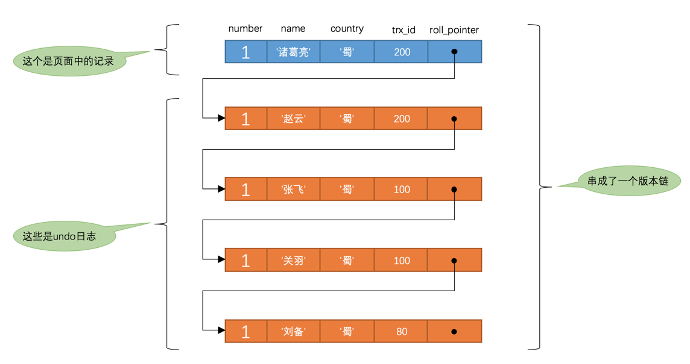

InnoDB

存储方式：

InnoDB采取的方式是：将数据划分为若干个页，以页作为磁盘和内存之间交互的基本单位，InnoDB中页的大小一般为 16 KB。也就是在一般情况下，一次最少从磁盘中读取16KB的内容到内存中，一次最少把内存中的16KB内容刷新到磁盘中。页是MySQL中磁盘和内存交互的基本单位，也是MySQL是管理存储空间的基本单位。

行格式：
Compact、Redundant、Dynamic和Compressed

可以在创建或修改表的语句中指定行格式。

在Compact行格式中，把所有变长字段的真实数据占用的字节长度都存放在记录的开头部位，从而形成一个变长字段长度列表，各变长字段数据占用的字节数按照列的顺序逆序存放。

记录的真实数据除了c1、c2、c3、c4这几个我们自己定义的列的数据以外，MySQL会为每个记录默认的添加一些列（也称为隐藏列）。

DB_ROW_ID、DB_TRX_ID、DB_ROLL_PTR。
行ID、事务ID、回滚指针。


记录头信息：
固定5个字节。包含delete_mask、record_type、next_record等信息。


## InnoDB表对主键的生成策略

优先使用用户自定义主键作为主键，如果用户没有定义主键，则选取一个Unique键作为主键，如果表中连Unique键都没有定义的话，则InnoDB会为表默认添加一个名为row_id的隐藏列作为主键。

## 行溢出

在Compact和Reduntant行格式中，对于占用存储空间非常大的列，在记录的真实数据处只会存储该列的一部分数据，把剩余的数据分散存储在几个其他的页中，然后记录的真实数据处用20个字节存储指向这些页的地址。

数据页之间是一个双向链表，一个数据页内部是由next_record串联起来的单链表。根据主键查询一个记录的过程：根据主键大小二分法找到主键对应的槽。再从这个槽中的最小记录顺序遍历。

每个页的结尾有用于校验页完整性的file trailer。用于保证从内存中同步到磁盘的页的完整性。

## 表空间

系统表空间

独立表空间

## 视图

我们知道MySQL中的视图其实是虚拟的表，也就是某个查询语句的一个别名而已，所以在存储视图的时候是不需要存储真实的数据的，只需要把它的结构存储起来就行了。和表一样，描述视图结构的文件也会被存储到所属数据库对应的子目录下边，只会存储一个视图名.frm的文件。


## Buffer Pool

结构：缓存页16kb 与控制块一一对应。

内容：1)数据字典 2)数据页 3)索引页 4)自适应哈希索引 5)插入缓冲 6)锁信息。

怎么判断要找的数据页是否在缓冲池中？
HashMap<表空间+页号， 缓存页>

### 链表
free list：空闲链表，控制块对应的都是可用的缓存页。
LRU list：控制淘汰页面以及淘汰策略的链表。
flush list：对应着脏页的链表。

### LRU策略
按比例将LRU链表划分yong/old区，通常这个比例是63/37。
当磁盘上的某个页面在初次加载到Buffer Pool中的某个缓存页时，该缓存页对应的控制块会被放到old区域的头部。而不是整个链表的头部。

在对某个处在old区域的缓存页进行第一次访问时就在它对应的控制块中记录下来这个访问时间，如果后续的访问时间与第一次访问的时间在某个时间间隔内，那么该页面就不会被从old区域移动到young区域的头部，否则将它移动到young区域的头部。

为了优化频繁的向头部转移页面，在yong区域前1/4的数据页在再次访问时不会移动到头部。

### 脏页刷新策略
**后台有专门的线程**每隔一段时间负责把脏页刷新到磁盘，这样可以不影响用户线程处理正常的请求。主要有两种刷新路径：

1. 从LRU链表的冷数据中刷新一部分页面到磁盘。
2. 从flush链表中刷新一部分页面到磁盘。

一个影响用户体验的刷新场景：

当用户线程准备加载一个磁盘页到Buffer Pool时没有可用的缓存页，那么会判断目前old区的尾部有没有可以直接释放掉的未修改页面，如果没有的话会不得不将LRU链表尾部的一个脏页**同步**刷新到磁盘。这种刷新单个页面到磁盘中的刷新方式被称之为`BUF_FLUSH_SINGLE_PAGE`。

### change buffer
当要更新的页不在内存中时，对于唯一索引来说，需要将页面读入内存，判断没有冲突，插入这个值，执行结束。
对于普通索引来说，则是将更新记录在change buffer中，语句就执行结束了。这样就不用从磁盘中加载这个页面了。在后台有线程处理merege操作，后续对这个页面的访问也会触发merge操作。因此对于写多读少的场景，例如日志，交易记录等。change buffer 可以保存多次更新的修改，一次merge合并就减少了多次的IO,收益最大。

为什么唯一索引更新不能使用change buffer 呢？
因为对于普通索引来说，插入不可能失败，因此只要将更新的操作缓存在change buffer 中即可。这时可以向客户端返回更新成功的信息了。
但对于唯一索引来说，不真正的将页面加载进来就把不可能直到更新是否成功。因为需要判断要更新的索引列的值是否重复。若直接使用change buffer 的话，也不能告知客户端这次更新的操作成功与否。

# 事务

## 事务的状态


## 相关sql
```sql
begin/start transaction
UPDATE account SET balance = balance - 10 WHERE id = 1;
SAVEPOINT s1;	# 一个保存点
UPDATE account SET balance = balance + 10 WHERE id = 2;
ROLLBACK TO s1;	# 回滚到保存点s1处
COMMIT;
```

## 隐式提交
- DDL
`CREATE`、`ALTER`、`DROP`等。

- 事务控制或者关于锁定的语句
当我们在一个事务还没提交或者回滚时就又使用`START TRANSACTION`或者`BEGIN`语句开启了另一个事务时，会隐式的提交上一个事务。

- 加载数据的语句
`LOAD DATA`等。

- 关于MySQL复制的一些语句
`START SLAVE`、`STOP SLAVE`等。

- 其它的一些语句
`ANALYZE TABLE`、`CACHE INDEX`、`CHECK TABLE`、`FLUSH`、 `LOAD INDEX INTO CACHE`、`OPTIMIZE TABLE`、`REPAIR TABLE`、`RESET`等语句也会隐式的提交前边语句所属的事务。

## 并发事务带来的问题

***更新丢失***

即后一个事务的修改覆盖前一个事务的修改。如果在一个事物完成并提交事务之前，另一个程序员不能访问同一个表/行数据，则可避免此问题。

***脏写***
一个事务修改了另一个未提交事务修改的记录。
InnoDB 在更新一行数据时会为这个记录加上行锁。其他试
图修改这条数据的数据都将阻塞直到该事务提交，释放锁。

***脏读***

事务A读取到了事务B**已经修改但尚未提交的数据**，还在这个数据基础上做了操作。此时如果事务B**回滚**，A读取的数据无效，不符合**一致性consistency**要求 。


***不可重复读***

事务A读取到了事务B**已经提交的修改数据**，导致前后读取数据不一致。不符合事务的**隔离性isolation**。

***幻读***

和脏读类似，脏读是事务B里修改了数据，幻读是事务里面**新增**了数据。幻读重点强调的是以同样的查询条件读取到了之前没有获取的记录。
对记录的删除，导致读到的数据比原来少不算做幻读。

## 事务隔离级别

- 未提交读 Read uncommitted
可以避免脏写，通过加锁。

- 已提交读 Read committed
ReadView实现。

- 可重复读 Repeatable read

ReadView实现。
InnoDB 中MVCC机制可以避免幻读。
GAP锁也可以避免幻读。

- 可序列化 Serializable

通过加锁实现。

# MVCC

## 一致性读
事务利用MVCC进行的读取操作称之为一致性读，或者一致性无锁读，有的地方也称之为快照读。所有普通的SELECT语句（plain SELECT）在READ COMMITTED、REPEATABLE READ隔离级别下都算是一致性读。

## 版本链
每条记录的隐藏列roll_pointer 指向一条undo log。每条undo日志也都有一个roll_pointer属性（INSERT操作对应的undo日志没有该属性，因为该记录并没有更早的版本），可以将这些undo日志都连起来，串成一个链表，所以现在的情况就像下图一样：


## ReadView
四个属性：

- `m_ids`：表示在生成ReadView时当前系统中**活跃**的读写事务的事务id列表。
- `min_trx_id`：表示在生成ReadView时当前系统中活跃的读写事务中最小的事务id，也就是m_ids中的最小值。
- `max_trx_id`：表示生成ReadView时系统中应该**分配给下一个事务的id值**。
- `creator_trx_id`：表示生成该ReadView的事务的事务id。只有在对表中的记录做改动时（执行INSERT、DELETE、UPDATE这些语句时）才会为事务分配事务id，否则在一个只读事务中的事务id值都默认为0。

有了这个ReadView，这样在访问某条记录时，只需要按照下边的步骤判断记录的某个版本是否可见：

- 如果被访问版本的trx_id属性值与ReadView中的creator_trx_id值相同，意味着当前事务在访问它自己修改过的记录，所以该版本**可以**被当前事务访问。

- 如果被访问版本的trx_id属性值小于ReadView中的min_trx_id值，表明生成该版本的事务在当前事务生成ReadView前已经提交，所以该版本**可以**被当前事务访问。

- 如果被访问版本的trx_id属性值大于ReadView中的max_trx_id值，表明生成该版本的事务在当前事务生成ReadView后才开启，所以该版本**不可以**被当前事务访问。

- 如果被访问版本的trx_id属性值在ReadView的min_trx_id和max_trx_id之间，那就需要判断一下trx_id属性值是不是在m_ids列表中，如果在，**说明创建ReadView时生成该版本的事务还是活跃的，该版本不可以被访问**；如果不在，**说明创建ReadView时生成该版本的事务已经被提交，该版本可以被访问**。

如果某个版本的数据对当前事务不可见的话，那就顺着版本链找到下一个版本的数据，继续按照上边的步骤判断可见性，依此类推，直到版本链中的最后一个版本。如果最后一个版本也不可见的话，那么就意味着该条记录对该事务完全不可见，查询结果就不包含该记录。

## 生成ReadView的时机

- READ COMMITTED —— **每次**读取数据前都生成一个ReadView

- REPEATABLE READ —— 在**第一次**读取数据时生成一个ReadView

## 关于Purge
- insert undo在事务提交之后就可以被释放掉了，而update undo由于还需要支持MVCC，不能立即删除掉。
- 为了支持MVCC，对于delete mark操作来说，仅仅是在记录上打一个删除标记，并没有真正将它删除掉。

随着系统的运行，在确定系统中包含最早产生的那个ReadView的事务不会再访问某些update undo日志以及被打了删除标记的记录后，有一个后台运行的purge线程会把它们真正的删除掉。

# redo log
为了保证事务的持久性，在事务提交完成之前，redo日志会把事务在执行过程中对数据库所做的所有修改都记录下来，在之后系统崩溃重启后可以把事务所做的任何修改都恢复出来。

## 优点
- redo日志占用的空间非常小
- redo日志是顺序写入磁盘的

## 格式


## redo日志刷盘时机
- log buffer空间不足时

- 事务提交时
之所以使用redo日志主要是因为它占用的空间少，还是顺序写，在事务提交时可以不把修改过的Buffer Pool页面刷新到磁盘，但是为了保证持久性，必须要把修改这些页面对应的redo日志刷新到磁盘。

- 后台线程以一定地频率不断地刷新
后台有一个线程，大约每秒都会刷新一次log buffer中的redo日志到磁盘。

- 正常关闭服务器时

- 做checkpoint时

## redo log 日志文件组


磁盘上的redo日志文件不只一个，而是以一个日志文件组的形式出现的。这些文件以ib_logfile[数字]（数字可以是0、1、2...）的形式进行命名。在将redo日志写入日志文件组时，是从ib_logfile0开始写，如果ib_logfile0写满了，就接着ib_logfile1写，同理，ib_logfile1写满了就去写ib_logfile2，依此类推。如果写到最后一个文件，那就重新转到ib_logfile0继续写。


## Log Sequence Number

初始：lsn = flushed_to_disk_lsn = checkpoint_lsn = 8704

当有新的redo日志写入到log buffer时，首先lsn的值会增长，但flushed_to_disk_lsn不变，随后随着不断有log buffer中的日志被刷新到磁盘上，flushed_to_disk_lsn的值也跟着增长。如果两者的值相同时，说明log buffer中的所有redo日志都已经刷新到磁盘中了。

## checkpoint
有一个很不幸的事实就是我们的redo日志文件组容量是有限的，我们不得不选择循环使用redo日志文件组中的文件，但是这会造成最后写的redo日志与最开始写的redo日志追尾，这时应该想到：redo日志只是为了系统奔溃后恢复脏页用的，如果对应的脏页已经刷新到了磁盘，也就是说即使现在系统奔溃，那么在重启后也用不着使用redo日志恢复该页面了，所以该redo日志也就没有存在的必要了，那么它占用的磁盘空间就可以被后续的redo日志所重用。也就是说：判断某些redo日志占用的磁盘空间是否可以覆盖的依据就是它对应的脏页是否已经刷新到磁盘里。

## 崩溃恢复过程

1. 确定恢复的起点-->checkpoint_no-->checkpoint lsn

2. 确定恢复的终点-->第一个不满512字节的log block

3. 开始恢复
- 跳过已经刷新到磁盘的页面
不需要重复执行lsn值小于FIL_PAGE_LSN的redo日志了，所以更进一步提升了奔溃恢复的速度。

- 使用哈希表
根据redo日志的space ID和page number属性计算出散列值，把space ID和page number相同的redo日志放到哈希表的同一个槽里，如果有多个space ID和page number都相同的redo日志，那么它们之间使用链表连接起来，按照生成的先后顺序链接起来的，如图所示：


避免了很多读取页面的随机IO,可以加快恢复速度.另外需要注意一点的是，同一个页面的redo日志是按照生成时间顺序进行排序的，所以恢复的时候也是按照这个顺序进行恢复，如果不按照生成时间顺序进行排序的话，那么可能出现错误。

# undo log

针对插入、删除和更新。

删除的过程：
先将delete_mask置为1，事务提交后再purge移除到垃圾链表中。

更新：
如果不涉及主键的更新：各字段大小一致可以就地更新。否则直接真正删除该记录，并重新插入一条新的记录。因此会产生两条undo log。但由于这个主键并没有更改，因此它在聚簇索引中的相对位置不变，其他事务以就可以看到这条记录的版本信息。


涉及主键的更新：先将delete_mask置为1，不真正的删除，再重新插入一条新的记录。是为了MVCC其他事务能正常访问聚簇索引中的记录。
同样的，它会产生一条delete undo log 和一条 insert undo log。

记录undo log时，会在事务需要的时候为它分配事务Id，并且针对修改过的记录的记录下它的trx_id，再将它的roll_pointer指向对应的undo log。

## undo log 的清除

在最早生成的ReadView中的事务id集合都已经提交，那么这些事务对应的undo log被删除。

# bin log

## 与redo log 对比

| redolog                                | binlog                           |
| -------------------------------------- | -------------------------------- |
| InnoDB 特有的                          | Server层实现，所有引擎都可以使用 |
| 物理日志，记录某个偏移量上做了什么修改 | 逻辑日志，记录原始的逻辑         |
| 循环写，空间固定                       | 追加写，不会覆盖之前的日志       |

## 两阶段提交保证主从一致

将redo_log拆分成了两个阶段：prepare 和 commit。保证提交时redo log 和 undo log 逻辑一致。


