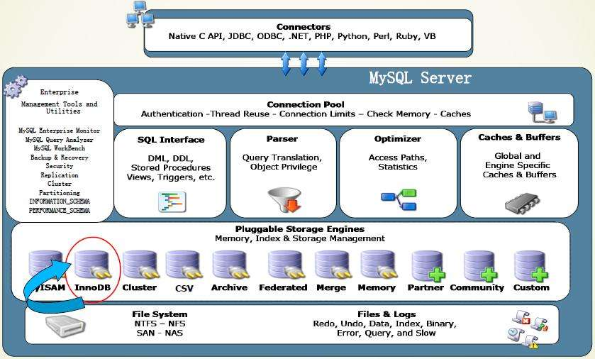
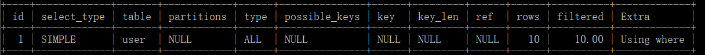

Mysql

# 认识

它其实分为Server, 和客户端（针对各种语言,实现它们声明，接口的驱动，例如com.mysql.jdbc.Driver）。
另外，MySQL 5.7 CMD Client其实就是它自带的一个命令行的客户端。
Server启动后在3306端口监听，等待客户端建立tcp连接(根据url, name, password)。
连接建立以后，客户端可以发出DML / DDL 编写的语句，服务器（调用存储引擎）进行执行。
执行的结果通过tcp连接返回。

建的库，库信息，表结构，表数据都在默认的Data目录下

# 日志

log-bin 主从复制
log-error	记录严重错误
log

frm 存放表结构
myd 存放表数据
myi	存放表索引

# 架构


- 连接

- 服务
生成了查询计划后，调用底层存储引擎提供的API,获取到数据返回给客户端。


- 引擎
向 server 层提供统一的调用接口，包含几十个底层函数，像“读取索引第一条记录” 、“读取索引下一条内容” 、“插入数据”。

- 存储

# SQL优化

慢的原因？执行时间/等待时间长？

查询语句写的烂、索引失效、关联查询太多join、服务器调优及各个参数设置

# 索引

索引本身也很大，不可能全部存储在内存中，因此往往以索引文件的方式存储在磁盘上。

## 相关SQL语句

```sql
# 创建索引
create [unique] index indexName on tableName(columnName(length))
alter table add [unique] index [indexName] on (columnName(length))
# 删除索引
drop index [indexName] on tableName
# 展示索引
show index [indexName] from tableName
```


## 索引类型
1. 单值索引

2. 复合索引/联合索引

3. 唯一索引
索引列的值必须唯一，但允许有空值

4. 外键索引

5. 全文索引

两个字段上各自的单值索引能够代替这两个字段的联合索引吗？
不好！

一次查询只能加载一个索引去使用吗？
索引合并，多次回表，取交集或并集最后会主表。因此必须满足等值匹配索引的全部列才能使用索引的合并，因为这时是按照主键的顺序排列的，可以降低合并(find intersections of two (sorted) arrays)的时间复杂度。O(nlogn) --> O(n).

## 索引结构

1. B+ Tree

B+树非叶子节点不存储数据，只存储指引搜索方向的数据项。只有叶子节点存储数据。
一次查询只需要等同于B+树高度的IO次数。而如果没有索引的话，每个数据项都要发生一次IO，可能需要百万次的IO。

**B+树的调整？**

懒惰删除：
- 大数据时代用户数据最好不删
- 为了维护索引
- 减小间隙锁带来的危害

结论：频繁删改的表不适合建索引。

2. Hash

3. full-text

4. R-Tree

## delete, update对索引的影响

非索引列的update？
不会影响这条记录在索引中的位置，聚簇索引未改变。还是能根据索引列找到对应的主键，再根据主键上的聚簇索引找到数据页。

主键的update？
不推荐主键update。主键update意味着原来的根据原B+树的节点找不到需要的数据页。需要调整B+树。 


## 优劣势
优点：
1. 提高检索效率，降低IO成本。通过**索引列**
2. 数据进行了排序，降低数据排序成本，降低了CPU的消耗

缺点： 
1. 实际上也是一张表，保存了主键和索引字段。并且指向表的实体记录。所以索引是要占空间的。

2. 降低了更新(insert, update, delete)的速度。更新表时不仅要更新表数据，还要更新索引。

3. 优秀的索引需要时间不断调整和优化。

## 建索引的情况
1. 主键自动建立唯一索引
2. 频繁作为查询条件的字段
3. 查询中与其他表关联的字段，外键关系需要建立索引
4. 频繁更新的字段不适合建索引
5. where 条件里用不到的字段不创建索引
6. 组合索引优先于单值索引
7. 查询中的排序的字段，排序字段若通过索引去访问将大大提高排序速度
8. 查询中统计或者分组字段

## 不要创建索引的情况
1. 表记录太少
2. 频繁增删改的字段
3. 某个数据列重复内容太多，为它建立索引就没有太大的实际效果
	也就是选择性低的字段不建索引。选择性是指索引列中不同值的数目与表中记录数的比。越接近1就越高。

# JOIN

SQL执行顺序
1. 手写
2. 机读
3. 总结

一个复杂join查询的模板：
```sql
select distinct <select_list>
from <left_table> <join_type>
join <right_table> on <join_condition>
where
	<where_condition>
group by
	<group_by_list>
having
	<having_condition>

```

而SQL 的 parser认为执行顺序可能是这样：

```sql
from <left_table> <join_type>
join <right_table> on <join_condition>
where
	<where_condition>
group by
	<group_by_list>
having
	<having_condition>
select distinct <select_list>
order by
	<order_by_condition>
limit <limit_number>
```

# UNION
UNION 操作符用于合并两个或多个 SELECT 语句的结果集。

请注意，UNION 内部的每个 SELECT 语句必须拥有相同数量的列。列也必须拥有相似的数据类型。同时，每个 SELECT 语句中的列的顺序必须相同。


# 7种JOIN


数据准备
1. user(id int primary key auto_increment, name varchar)
2. student(id int primary key auto_increment, age int, name varchar)

```sql
# 左连接
select *
from user u
left join student s
on u.name = s.name;

# 左连接去除公共部分
select *
from user u
left join student s
on u.name = s.name
where s.name is null;

# 右连接
select *
from user u
right join student s
on u.name = s.name;

# 右连接去除公共部分
select *
from user u
right join student s
on u.name = s.name
where u.name is null;

# 内连接
select *
from user u
inner join student s
on u.name = s.name;

# 全连接 MySQL不支持 用union合并两个结果集实现
select * from user u left join student s on u.name = s.name
union
select * from user u right join student s on u.name = s.name;

# 全连接 去除共有部分
select * from user u left join student s on u.name = s.name where s.name is null
union
select * from user u right join student s on u.name = s.name where u.name is null;
```


# MySQL性能分析

MySQL Query Optimizer

MySQL 常见瓶颈
CPU：
IO：
服务器硬件的性能瓶颈：

Explain

各个字段

样例：
```sql
explain select * from user where name = 'user1';
```


- *id*
select查询的序列号，包含一组数字，表示查询中执行select子句或操作表的顺序。
id相同时，执行顺序从上到下。
id不同时，如果是子查询，id的序号会递增，id的值越大优先级越高，越先被执行。

- ***select_type***

1. simple
2. primary
3. subquery
4. derived	包含在from中的查询，查询结果作为一张衍生表。
5. union 一般为union后接的select查询。
6. union reult	将两个结果集union的操作。

- ***table***
显示这一行的数据是关于那张表的。

- ***type***

访问类型：

`*system > const > eq_ref > ref > range > index > ALL*`

`system`:单表单行记录,特殊情况下的const

`const`: 表示通过索引一次就找到了。通常会出现在primary key 或者 unique key.因为只匹配一行数据，所以很快。如将主键置于`where`列表中，MySQL就能将该查询转换为一个常量。

`eq_ref`:唯一性索引扫描，对于每个索引键，只有一条记录与之匹配。常见于primary key/ unique key.

`ref`:非唯一性索引扫描，返回匹配某个值的所有行。

`range`:只检索给定范围的行，使用一个索引来选择行。它比全表扫描好，因为它只需要开始于索引的某一点，而结束于另一点，不用全表扫描索引。出现在between, <, >, in中。

`index`:全索引扫描。比全表扫描好，因为它只扫描索引树。这通常比ALL快，因为索引文件通常比数据文件小。而且索引有可能在内存中，而不是磁盘中。

`ALL`: 全表扫描。 

- ***possible_keys***
显示可能应用在这张表上的索引列表。

- ***key***
实际被使用的索引。若未使用则为NULL。
查询中若使用了覆盖索引，则该索引仅出现在key列表中。

- ***key_len***
表示索引字段中使用的字节数，可通过该列计算查询中使用的索引的长度。在不损失准确性的情况下，长度越短越好。key_len显示的值是索引字段的最大可能长度，**并非实际使用长度**，即key_len是根据表定义计算而得，不是通过表内检索出的。

- ***ref***
显示索引的哪一列被使用了，如果可能的话，是一个常数。哪些列或常量被用于查找索引列上的值。

- ***rows***
根据表统计信息及索引选择情况，大致**估算**出找到所需记录所需要读取的行数。

- ***Extra***

**1. Using filesort**
索引失效或者没有可用的索引，MySQL启动文件排序自己额外做一次排序。

**2. Using temporary**
使用了临时表保存中间结果，MySQL在对查询结果排序时使用临时表。常见于 order by 和分组查询 group by 以及 union操作。

**3. Using index**
使用了索引。

4. Using where
5. Using join buffer
6. Impossible WHERE
7. select tables optimized away
8. distinct


## 覆盖索引
select 数据列只用从索引中就能够取得，不必读取数据行，MySQL可以利用索引返回select 列表中的字段，而不必根据索引再次读取数据文件，换句话说查询列要被**所建的索引覆盖。**

## 聚集索引和非聚集索引

> 聚集索引定义：数据行的物理顺序与列值（一般是主键的那一列）的逻辑顺序相同，一个表中只能拥有一个聚集索引。

> 非聚集索引定义：该索引中索引的逻辑顺序与磁盘上行的物理存储顺序不同，一个表中可以拥有多个非聚集索引。

值得注意的是，最好还是在创建表的时候添加聚集索引，由于聚集索引的物理顺序上的特殊性，因此如果再在上面创建索引的时候会根据索引列的排序移动全部数据行上面的顺序，会非常地耗费时间以及性能。

非聚集索引存在的问题就是当它的索引字段没有覆盖select 列表的字段时，会根据叶子节点的指针**二次查询**，也就是**回表**。去查询那些没有被覆盖的字段。效率比较低。

在InnoDB中会自动地创建聚簇索引，聚簇索引就是数据地存储方式(所有的用户记录都存储在了叶子节点)。也就是所谓的索引即数据，数据即索引。

使用二级索引应当注意，当回表次数过多时，效率反而不如全表扫描。

## 索引失效与索引优化

1. 最佳左前缀法则
2. 不在索引列上做任何操作(计算，函数，手动或自动的类型准换),  会导致索引失效转向全索引扫描或者全表扫描。
3. 存储引擎不能使用范围条件右边的列。
4. 尽量使用覆盖索引，即只查询索引包含的列。减少 `select * `。
5. 使用 `!=` `<>` 都会导致全索引扫描或者全表扫描。
6. `like '%xx'` 会导致索引失效。实在要使用可以使用覆盖索引，或者搜索引擎。
7. 少用`or`。用它连接会索引失效。
8. 适当的使用字符串前缀索引
9. 让主键拥有auto_increment属性，能让聚簇索引尽可能少的发生页面分裂记录和记录移位的情况。

## 函数FUNCTION
```sql
/*重新定义分隔符，保证这段语句不中断的执行*/
delimiter $$
/*返回长度为n的字符串*/
create function rand_string(n int) returns varchar(255)
begin
    declare char_str varchar(100) default 'abcdefghijklmnopqrstuvwxyzABCDEFGHIJKLMNOPQRSTUVWXYZ';
    declare return_str varchar(255) default '';
    declare i int default 0;
    while i < n do
        set return_str = concat(return_str, substring(char_str, floor(1 + rand() * 52), 1));
        set i = i + 1;
    end while;
    return return_str;
end $$
```

## 存储过程PROCEDURE

```sql
/*向user表中一次性插入max_num条数据*/
delimiter $$
create procedure insert_user(in max_num int(10))
begin
declare i int default 0;
/*关闭自动提交*/
set autocommit = 0;
repeat
set i = i + 1;
insert into user value(null, rand_string(6));
until i = max_num
end repeat;
commit;
end $$
```

使用： `call insert_user(50000);` 耗时25s.

## in / exist
**小表驱动大表，从连接建立释放的角度和MySQL基于成本的优化规则来分析**

```sql
select * from A where id in (select id from B);
```
适用于A表大于B表。

```sql
select * from A where exist (select 1 from B where B.id = A.id);
```
适用于A表小于B表。
可以理解为将A的数据放到子查询中做条件验证，根据验证结果(true/fasle)来决定著查询的数据结果是否保留。

两者功能相似可以互相替换。

## order by

MySQL支持两种排序：`filesort` 和 `index`。即文件扫描排序和扫描有序索引排序。
`index` **优于** `filesort`.

排序字段最好同增同降，否则会失效。
**默认升**，如果索引字段`（name, age）`，那么`order by name , age `会用`index`。
而`order by name asc, age desc` 则会产生`filesort`.

filesort 两种算法: 双路排序和单路排序。

双路：第一次读取行指针和order by的列，在buffer 中排序，然后扫描排序后的列表，按照列表中的值重新从列表中读取对应的数据输出。
从磁盘中取**排序字段**，在buffer上排序，再根据排序后的列表**从磁盘中读取其他字段**。

单路：从磁盘读取查询需要的**所有列**，排序后直接输出。因为每一列都保存在内存中了。由于sort buffer的限制，超出sort_buffer_size后，会创建临时文件tmp进行合并排序。有可能出现**多次的IO**。

max_length_for_sort_data
当query的字段大小总和小于这个字段会用单路排序，否则用老算法多路排序。

## group by

实质是先排序后分组，遵照索引的最佳左前缀匹配。
优化策略和order by 类似。

值得注意的是having 的效率 差于 where。 能在where 里限定的最好就不要在having中限制。

## show profile

将一句SQL执行的时间分解，展示每一步花了多少时间。

一般来说比较重要的两个指标：cpu 和  block io

```sql
show profile cpu , block io for query Query_id;
```

报警信号：
- *creating tmp table*
- *copying to tmp table on disk*
- *locked*
- *sorting result*


