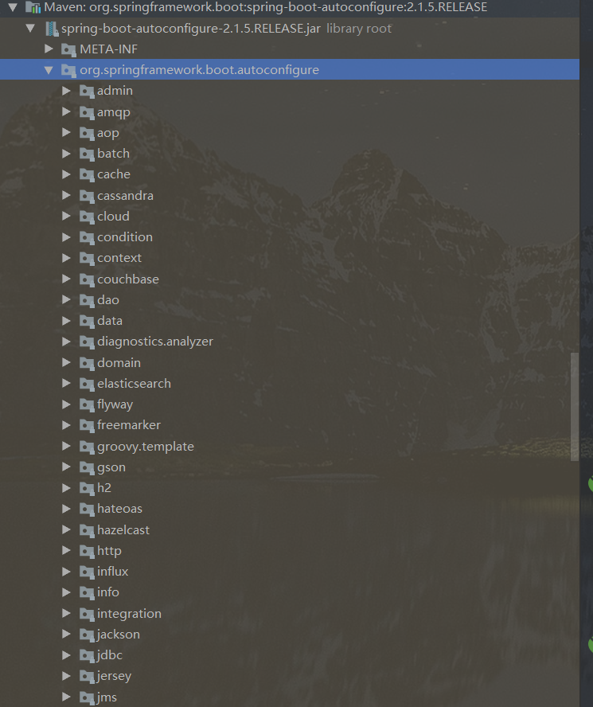

# Spring, SpringMVC, SpringBoot


获取上下文（ApplicationContext）的方式：
1. xml: new ClassPathXmlApplicationContext("spring.xml")
2. java配置类： new AnnotationConfigApplicationContext(TestConfiguration.class)
3. ApllicationContextAware

ApllicationContextAware 


主要功能：获取一个context。
使用ApllicationContextAware的方式：
	添加一个类实现该接口，重写setApplicationContext。将该方法的参数传入你所定义的一个context对象。
	就可以得到一个context对象。

```java
public class SpringContextHolder implements ApplicationContextAware {
	private static ApplicationContext applicationContext = null;
	
	/**
	 * 实现ApplicationContextAware接口, 注入Context到静态变量中.
	 */
	@Override
	public void setApplicationContext(ApplicationContext applicationContext) {
		SpringContextHolder.applicationContext = applicationContext;
	}

	/**
	 * 获取静态变量中的ApplicationContext.
	 */
	public static ApplicationContext getApplicationContext() {
		return applicationContext;
	}
 
}
```
接口传递的是哪个层次的context, 上下文， 容器？


## Spring boot取代xml 的方法？

@Configuration --> xml
@Bean --> bean

## AOP自动织入

自动织入需要在xml配置中声明 `<aop:aspectj-autoproxy />`。
或者 `@EnableAutoProxy` 修饰配置类。

并且只有在容器真正通过xml或者java配置类生成的时候，才会去检测这些织入，去执行动态代理。

## 获取Bean
1. @ComponentScan 会自动扫描所在类的同级目录所有包，及其子目录  所以application可以扫描所有包
2. 通过自己创建context， 结合(xml/java config)获取。
3. @Autowired


## SpringBoot核心注解
```java
@Target(ElementType.TYPE)
@Retention(RetentionPolicy.RUNTIME)
@Documented
@Inherited
@SpringBootConfiguration	//因此它本身就是一个java配置类，可以用它来生成一个context
@EnableAutoConfiguration	//自动配置
@ComponentScan(excludeFilters = {
		@Filter(type = FilterType.CUSTOM, classes = TypeExcludeFilter.class),
		@Filter(type = FilterType.CUSTOM,
				classes = AutoConfigurationExcludeFilter.class) })	//排除自动扫描的类
public @interface SpringBootApplication{
	//根据Class对象排除自动配置的类
	@AliasFor(annotation = EnableAutoConfiguration.class)
	Class<?>[] exclude() default {};

	//根据类名排除自动配置的类
	@AliasFor(annotation = EnableAutoConfiguration.class)
	String[] excludeName() default {};

	//根据包名指定扫描bean，默认被注解的类的同级目录及其子目录
	@AliasFor(annotation = ComponentScan.class, attribute = "basePackages")
	String[] scanBasePackages() default {};

	//根据Class对象指定扫描bean
	@AliasFor(annotation = ComponentScan.class, attribute = "basePackageClasses")
	Class<?>[] scanBasePackageClasses() default {};
}
```

该注解是一个**组合注解**，等同于同时注解了它以及它之上的元注解。

## SpringBoot 自动配置

根据所导入的jar包/pom依赖，自动进行各种各样的自动配置。
可以通过以下的方式排除：
```java
//排除了对dataSource的自动配置，否则在导入jdbc相关库时会报错
//找不到对应dataSource
//若不关闭对于此项的自动配置，那么可以在application。.properties中添加对应的配置项
@SpringBootApplication(exclude = {DataSourceAutoConfiguration.class})
public class SakilaApplication {
    public static void main(String[] args) {
        SpringApplication.run(SakilaApplication.class, args);
    }
}
```


## SpringBoot Vs. SpringMVC

1. 取代了web.xml，自动配置了DispatcherServlet(load-on-startup/path)。当然，也可以在application.properties中修改配置。
2. 自动配置了view resolver 和 mulptipart resolver
3. 静态资源默认放在static文件夹下，html放在template下面。 
```xml
<!-- 放在这里即可加载 -->

```
4. 默认后缀为html


## @Autowired 注解在属性、set方法、构造方法上？

## @Import 
在列表中，@Import 是被用来整合所有在@Configuration注解中定义的bean配置。这其实很像我们将多个XML配置文件导入到单个文件的情形。
@Import注解的使用。这个注解帮助我们将多个配置文件（可能是按功能分，或是按业务分）导入到单个主配置中，以避免将所有配置写在一个配置中。

@Configuration 本来就组合了@Component


## 自动配置
org.springframework.boot:spring-boot-autoconfigure:2.1.5RELEASE

这个jar包下面包含了各种配置



例如ThymeleafAutoConfiguration，它是一个配置类，与它配套的是一个ThymeleafProperties。
在ThymeleafProperties上面会有一个注解@ConfigurationProperties(prefix = "spring.thymeleaf")
意味着它在application.properties里面占有一个spring.thymeleaf命名空间，可以通过这个空间获取属性。