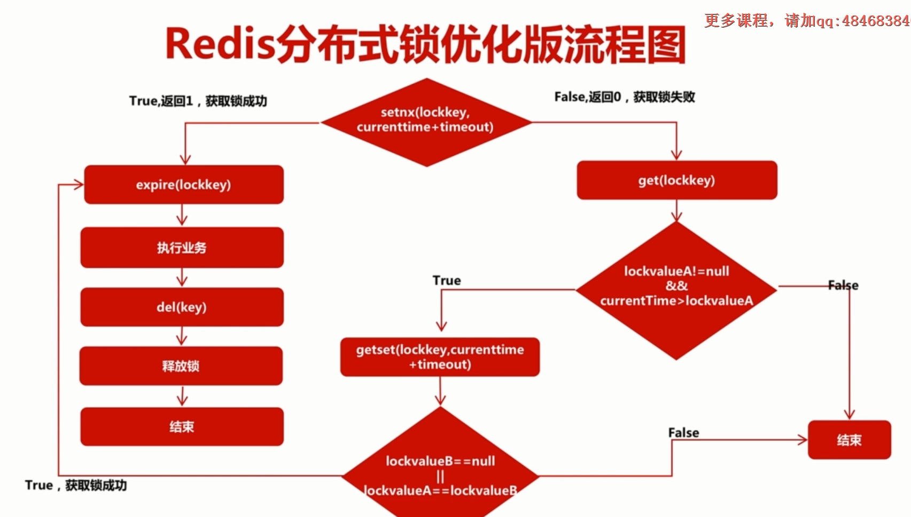

架构演进慕课

Lombok编译时修改语法树。

反编译验证。

修改 /etc/profile

export CATALINA_BASE=/www/server/apache-tomcat-default
export CATALINA_HOME=/www/server/apache-tomcat-default
export TOMCAT_HOME=/www/server/apache-tomcat-default

source /etc/profile


在# OS行下面新增
export CATALINA_BASE=$CATALINA_BASE
export CATALINA_HOME=$CATALINA_HOME


linux 部署 Inventory项目后 403
解决：
原因：linux下对tomcat文件夹的访问权限不够导致出现错误

解决：cd 到 tomcat文件夹的上一级目录，执行如下命令

chmod -R 777 xxx  (xxx是你tomcat文件夹的名字)

Nginx 负载均衡配置

```css
http {
 
	# ... 省略其它配置
 
	upstream tomcats{
		server 127.0.0.1:8080;
		server 123.207.163.104:80;
	}
 
	server {
		listen 80;
 
		location / {
			proxy_pass http://tomcats;
		}
	}
 
	# ... 省略其它配置
}
```

proxy_pass http://tomcats：表示将所有请求转发到tomcats服务器组中配置的某一台服务器上。
upstream模块：配置反向代理服务器组，Nginx会根据配置，将请求分发给组里的某一台服务器。tomcats是服务器组的名称。


redis初始内存 834.61k

插入1000条string后 --> 897.27k

再插入10000条string后 --> used_memory_human:1.53M


redis  命令
flushdb / flushall

keys *

dbsize

单点登陆  redis cookie jackson filter

cookie 一年
token: jsession id 有效期30分钟

版本1中忘记密码的实现：输入安全问题和答案和数据库验证成功后，会生成一个缓存在Guava Cache的forgetToken，并返回给客户端。客户端带着这个Token去修改密码。

一致性哈希算法：
Consistent Hash

命中率公式： 1 - n / (n + m) 
服务器台数：n
新增服务器台数：m

RESTFul
每个url代表一个资源  通过url定位到一个资源


setnx --> 原子性  判断有无该key，没有再set
getset --> 原子性
expire
del



在拿到锁的这段时间timeout里面，任务没有结束怎么办？
